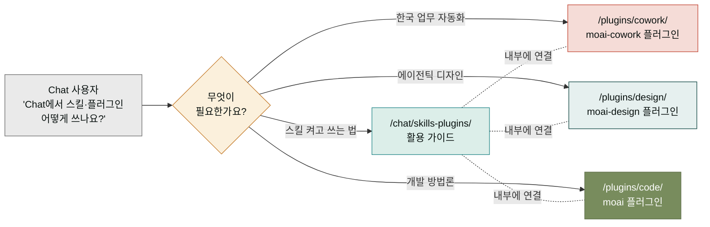

## 왜 이 페이지가 plugins 섹션에 또 있을까요

`/plugins/` 섹션은 보통 "설치하는 빌드 플러그인"을 나열하는 자리입니다. 그런데 Claude의 **Chat**(데스크탑 앱과 웹)은 플러그인과 스킬을 다루는 동선이 제품 단위로 통합되어 있어, "Chat에서는 스킬·플러그인을 어떻게 쓰나요?"라는 질문이 빌드된 Chat 전용 플러그인이 없어도 계속 발생합니다. 그래서 이 페이지는 **Chat 전용 플러그인을 판매하는 곳이 아니라**, Chat에서 스킬과 플러그인을 **활용하는 방법을 모아둔 문서 허브**입니다.

이 문서 허브는 `/chat/skills-plugins/`에 이미 자리 잡은 [스킬과 플러그인 페이지](/chat/skills-plugins/)의 관문 역할을 합니다. 즉, "플러그인을 찾고 있다 → 아래 세 가지 빌드 플러그인 카테고리(cowork/design/code)로, 스킬과 플러그인을 Chat에서 어떻게 켜고 쓰는지 알고 싶다 → /chat/skills-plugins/로" 동선을 나누는 안내판입니다. 빌드된 Chat 전용 플러그인은 이 페이지에서 서술하지 않습니다 — Chat은 설치형 플러그인 없이도 스킬과 커넥터, 프로젝트 기능으로 확장되도록 설계되었기 때문입니다.

## Chat은 "플러그인을 설치하는 자리"가 아닌 "확장이 자연스럽게 일어나는 자리"

Claude Chat을 처음 쓰기 시작하면, 기본 Claude만으로도 충분히 똑똑합니다. 그런데 브랜드 규칙을 매번 적용하거나, 엑셀 양식을 회사 표준에 맞추거나, 반복되는 업무를 자동화하고 싶을 때가 옵니다. 그때 등장하는 것이 **스킬(Skill)**이고, 스킬을 모아서 배포하는 단위가 **플러그인(Plugin)**입니다. 이 둘은 Chat 안에서도 쓸 수 있고, 아래에 나열한 cowork/design/code 플러그인을 통해 더 강력해집니다.

중요한 것은, Chat 자체가 "스킬을 불러오는 능력"을 이미 갖추고 있다는 점입니다. 그래서 이 페이지는 **"Chat에서 스킬·플러그인 활용"**을 주제로, Chat 사용자가 헤매지 않고 두 세계(기본 스킬 + 빌드 플러그인) 사이를 오갈 수 있도록 정리된 문서 허브입니다. Chat 전용 플러그인이라는 별도의 빌드 산출물을 소개하지 않는 이유가 바로 이것입니다 — Chat은 설치형 플러그인 없이도, 그리고 cowork/design/code 플러그인과 함께 쓸 때도, 동일한 스킬 체계 위에서 작동합니다.

## 이 허브가 연결하는 세 방향

### 1. Chat에서 스킬과 플러그인 다루기 (기본)

Chat 안에서 스킬을 켜고, 직접 만들고, 디렉터리에서 찾는 방법은 [스킬과 플러그인 페이지](/chat/skills-plugins/)가 전체를 다루고 있습니다. 거기서 다루는 내용을 짧게 옮겨두면 이렇습니다.

- **스킬이란** — Claude가 특정 작업을 더 잘 처리하도록 도와주는 지침·스크립트·자료가 담긴 폴더. 모든 요금제에서 사용 가능.
- **스킬의 4가지 종류** — Anthropic 스킬, 커스텀 스킬, 조직 제공 스킬, 파트너 스킬. 출처와 제작 주체가 각각 다름.
- **플러그인이란** — 스킬 여러 개를 묶어 마켓플레이스에서 설치할 수 있게 만든 배포 단위.
- **커스텀 스킬 만들기** — 개인이나 조직이 반복 작업을 자동화하도록 직접 스킬 폴더를 만드는 흐름.

### 2. 한국 실무를 위한 빌드 플러그인 — moai-cowork

스킬을 직접 만들기보다, 이미 한국 업무 패턴에 맞춰 다듬어진 스킬 177개를 한 번에 가져오고 싶다면 [moai-cowork 플러그인](/plugins/cowork/)이 그 역할을 합니다. 사업계획서·상세페이지·카드뉴스·SNS 캠페인·재무제표·계약서 검토까지 한국 비즈니스 컨텍스트에 특화된 도구 모음입니다.

### 3. 디자인·개발 작업을 위한 빌드 플러그인 — moai-design, moai

Chat이 아니라 Claude Design이나 Claude Code에서 작업한다면 [moai-design](/plugins/design/)과 [moai](/plugins/code/)가 각각 대응됩니다. 다만 두 플러그인 모두 Chat에서 보다는 전용 환경에서 의미가 있으므로, Chat 사용자라면 스킬 디렉터리와 cowork 플러그인부터 시작하는 것이 자연스럽습니다.

## 자주 묻는 질문 (요약)

- **Chat 전용 플러그인이 따로 있나요?** — 아니요. Chat은 스킬 체계를 통해 확장되도록 설계되어, 별도의 "Chat 전용 빌드 플러그인" 산출물은 없습니다. 대신 스킬과 커넥터, 프로젝트 기능이 그 자리를 채웁니다.
- **그럼 /plugins/ 섹션은 왜 Chat 카테고리를 가지나요?** — 이 허브 페이지가 Chat 사용자의 "스킬·플러그인 어떻게 쓰나요?" 질문을 받아 /chat/skills-plugins/로 안내하기 위해서입니다. 빌드 플러그인을 판매하는 자리가 아닙니다.
- **/chat/skills-plugins/와 이 페이지는 중복인가요?** — 이 페이지는 안내판이고, /chat/skills-plugins/가 본문입니다. 이 허브에서 한눈에 동선을 잡은 뒤 본문으로 넘어가는 구조입니다.

## 다음 단계

- **[스킬과 플러그인 (본문)](/chat/skills-plugins/)** — Chat에서 스킬을 켜고, 직접 만들고, 디렉터리에서 찾는 전체 흐름.
- **[moai-cowork 플러그인](/plugins/cowork/)** — 한국 실무 177개 스킬 모음. Chat에서 즉시 사용 가능.
- **[프로젝트 기능](/chat/projects/)** — 자주 쓰는 지식과 파일을 주제별로 모아두는 Chat 기능.

---

### Sources

- Claude 고객지원 — What are skills?: <https://support.claude.com/en/articles/12512176-what-are-skills>
- Claude 고객지원 — Use skills in Claude: <https://support.claude.com/en/articles/12512180-use-skills-in-claude>
- Claude 고객지원 — How to create custom skills: <https://support.claude.com/en/articles/12512198-how-to-create-custom-skills>
- Claude 고객지원 — Browse skills, connectors, and plugins in one directory: <https://support.claude.com/en/articles/14328846-browse-skills-connectors-and-plugins-in-one-directory>
- Claude 고객지원 — Use plugins in Claude: <https://support.claude.com/en/articles/13837440-use-plugins-in-claude>
- 본문 가이드 — [`/chat/skills-plugins/`](/chat/skills-plugins/)
- 빌드 플러그인 카테고리 — [`/plugins/cowork/`](/plugins/cowork/) · [`/plugins/design/`](/plugins/design/) · [`/plugins/code/`](/plugins/code/)
