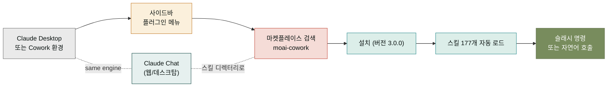

## 한국 실무 한 알의 플러그인, moai-cowork

`moai-cowork`는 한국 비즈니스 컨텍스트에 특화된 **177개 스킬을 하나의 플러그인으로 묶어 놓은 통합 패키지**입니다. 사업계획서를 쓰고, 이커머스 상세페이지를 만들고, SNS 캠페인을 기획하고, 재무제표를 정리하고, 계약서를 검토하는 일까지 — 한국 실무자가 반복해서 하는 작업을 Claude가 더 잘 처리하도록 다듬어 놓았습니다. 이전에는 28개의 개별 플러그인으로 나뉘어 있었지만, [SPEC-MOC-PLUGIN-REMEDIATION-001](https://github.com/modu-ai)을 거치며 단일 플러그인(`moai-cowork`, 버전 3.0.0)으로 통합되었습니다.

이 플러그인이 다른 스킬 모음과 다른 점은 두 가지입니다. 첫째, **도메인 분리가 아닌 도메인 통합**을 전제로 합니다. 사업·마케팅·콘텐츠가 한 작업 안에서 같이 쓰이는 한국 실무 패턴에 맞추어, 스킬 간 호출이 자연스럽게 일어나도록 설계되었습니다. 둘째, **한국 규제·양식·관행**을 코드와 프롬프트에 담고 있습니다 — 예컨대 `commerce-marketing-compliance-kr` 스킬은 한국 이커머스 표시광고법을, `office-hwpx-writer`는 한글(hwp) 문서 생성을 다룹니다. 범용 영어권 스킬 모음으로는 채워지지 않는 부분을 한국 실무에 맞춰 채우는 것이 이 플러그인의 역할입니다.

## 설치 흐름 한눈에 보기

설치는 Cowork 사이드바의 **플러그인 → 마켓플레이스**에서 `moai-cowork`를 검색한 뒤 설치 버튼을 누르면 끝납니다. 설치가 끝나면 177개 스킬이 자동으로 로드되어, 슬래시 명령(`/office-pdf-writer`, `/commerce-detail-page-copy` 등)이나 자연어 요청("상세페이지 카피 써 줘")으로 스킬을 호출할 수 있습니다. 업데이트는 `/plugin marketplace update moai-cowork` 한 줄이면 됩니다.

## 대표 스킬 Top 5

아래 다섯 스킬은 moai-cowork 안에서도 가장 많이 쓰이고, 다른 스킬의 시작점이 되는 대표 스킬입니다. 처음 설치한 뒤 가장 먼저 시도해 보기 좋은 순서로 정렬했습니다.

| 스킬 | 하는 일 | 자주 같이 쓰는 스킬 |
|---|---|---|
| **office-pdf-writer** | PDF 양식 문서(제안서·보고서·안내문) 자동 생성 | `office-docx-generator`, `office-hwpx-writer` |
| **commerce-detail-page-copy** | 이커머스 상세페이지 카피라이팅 (헤드라인·상품설명·혜택) | `commerce-detail-page-image`, `commerce-product-photo-brief` |
| **content-sns-content** | SNS용 카드뉴스·캡션·해시태그 일괄 생성 | `content-card-news`, `media-gemini-3-image-prompt` |
| **marketing-campaign-planner** | 마케팅 캠페인 타임라인·채널별 메시지 기획 | `marketing-meta-ads-manager`, `marketing-landing-page` |
| **business-strategy-planner** | 사업 전략·BCG 매트릭스·성장 경로 정리 | `business-executive-summary`, `business-roadmap-manager` |

`office-pdf-writer`는 문서 산출물이 가장 명확해서 "이 플러그인이 실제로 일을 하나?"를 가장 빨리 확인할 수 있습니다. 이어서 `commerce-detail-page-copy`는 카피 톤을, `content-sns-content`는 콘텐츠 양식을 익히고, 그 위에 `marketing-campaign-planner`와 `business-strategy-planner`로 전략적 기획까지 확장하는 동선이 자연스럽습니다.

## 전체 스킬 인덱스 (177개)

스킬은 도메인 접두사별로 12개 그룹으로 정리됩니다. 같은 그룹 안에서는 서로 호출이 잦어 그룹 단위로 익히는 것이 효율적입니다.

### book (8) — 출판·집필

`book-author-bio` · `book-chapter-writer` · `book-concept-planner` · `book-outline-designer` · `book-proposal-writer` · `book-publisher-matcher` · `book-revision-coach` · `book-target-reader`

### business (37) — 사업·전략·운영

`business-brand-identity` · `business-conflict-handler` · `business-consulting-brief` · `business-draft-offer` · `business-draft-response` · `business-employment-manager` · `business-escalation-manager` · `business-executive-summary` · `business-feedback-loop` · `business-interview-coach` · `business-job-analyzer` · `business-kb-article` · `business-kr-gov-grant` · `business-market-analyst` · `business-meeting-facilitator` · `business-negotiation-1on1` · `business-people-operations` · `business-performance-review` · `business-pm-weekly-report` · `business-portfolio-guide` · `business-process-manager` · `business-productivity-weekly-report` · `business-proposal-writer` · `business-report-speak` · `business-resume-builder` · `business-resume-screener` · `business-roadmap-manager` · `business-sales-playbook` · `business-sbiz365-analyst` · `business-spec-writer` · `business-startup-launchpad` · `business-status-reporter` · `business-strategy-planner` · `business-ticket-triage` · `business-ux-designer` · `business-ux-researcher` · `business-vendor-manager`

### commerce (31) — 이커머스·스토어 운영

`commerce-automation-audit` · `commerce-channel-message` · `commerce-coupang-ad-optimizer` · `commerce-detail-page-copy` · `commerce-detail-page-image` · `commerce-detail-page-planner` · `commerce-early-fan-builder` · `commerce-influencer-collab` · `commerce-integrated-strategy` · `commerce-jtbd-persona` · `commerce-live-commerce` · `commerce-ltv-cac-architect` · `commerce-margin-calculator` · `commerce-market-research` · `commerce-marketing-compliance-kr` · `commerce-marketplace-coupang` · `commerce-marketplace-coupang-ads` · `commerce-marketplace-crowdfunding` · `commerce-marketplace-curation` · `commerce-marketplace-d2c` · `commerce-marketplace-naver` · `commerce-morning-brief` · `commerce-product-detail` · `commerce-product-image-pipeline` · `commerce-product-naming` · `commerce-product-photo-brief` · `commerce-promotion-planner` · `commerce-repurchase-timer` · `commerce-season-calendar` · `commerce-subscription-strategist` · `commerce-voc-triage`

### content (8) — 콘텐츠 제작

`content-blog` · `content-card-news` · `content-copywriting` · `content-editorial-calendar` · `content-email-sequence` · `content-newsletter` · `content-sns-content` · `content-social-media`

### education (11) — 교육·학습

`education-assessment-creator` · `education-course-followup-sequence` · `education-course-operations-manual` · `education-curriculum-designer` · `education-grant-writer` · `education-learning-material` · `education-learning-project` · `education-paper-search` · `education-paper-writer` · `education-research-assistant` · `education-tutor-research`

### finance (11) — 재무·세무

`finance-close-management` · `finance-econ-literacy` · `finance-financial-statements` · `finance-household-budget` · `finance-insurance-fit` · `finance-invest-primer` · `finance-investor-relations` · `finance-personal-tax-saver` · `finance-tax-helper` · `finance-variance-analysis` · `finance-wealth-roadmap`

### general (16) — 공통 유틸리티

`general-ai-diagnostic` · `general-ai-slop-reviewer` · `general-cd-brief` · `general-cd-handoff-reader` · `general-cd-prompt-builder` · `general-cd-slop-check` · `general-cd-system-prep` · `general-event-planner` · `general-feedback` · `general-humanize-korean` · `general-self-care` · `general-skill-builder` · `general-skill-template` · `general-skill-tester` · `general-travel-planner` · `general-wellness-coach`

### legal (8) — 법무·컴플라이언스

`legal-compliance-check` · `legal-contract-review` · `legal-iros-registry-automation` · `legal-legal-risk` · `legal-mfds-safety` · `legal-nda-triage` · `legal-patent-analyzer` · `legal-patent-search`

### marketing (11) — 마케팅·광고

`marketing-campaign-planner` · `marketing-landing-page` · `marketing-landing-page-conversion-audit` · `marketing-meta-ads-analyzer` · `marketing-meta-ads-manager` · `marketing-performance-report` · `marketing-personal-branding` · `marketing-pixel-audit` · `marketing-seo-audit` · `marketing-target-script` · `marketing-youtube-podcast-planner`

### media (9) — 미디어 생성

`media-asset-production` · `media-audio-gen` · `media-codex-image` · `media-gemini-3-image-prompt` · `media-gpt-image-2-prompt` · `media-higgsfield-image` · `media-higgsfield-video` · `media-midjourney-v8-prompt` · `media-notebooklm-slide-prompt`

### office (26) — 오피스 문서·데이터

`office-business-real-estate-search` · `office-daily-briefing` · `office-data-explorer` · `office-data-public-data` · `office-data-visualizer` · `office-design-system-library` · `office-docx-generator` · `office-finance-court-auction-search` · `office-finance-korean-stock-search` · `office-goal-planner` · `office-habit-routine` · `office-html-report` · `office-html-slide` · `office-hwpx-writer` · `office-korean-spell-check` · `office-mcp-connector-setup` · `office-notion-template-kit` · `office-pdf-writer` · `office-pptx-designer` · `office-public-data-court-auction-search` · `office-public-data-korean-stock-search` · `office-public-data-public-data` · `office-public-data-real-estate-search` · `office-retro-builder` · `office-time-system` · `office-xlsx-creator`

### project (1) — 프로젝트 메타

`project` — 프로젝트 설정·문서 품질·스킬 간 연결을 다루는 메타 스킬.

## 레시피 — 스킬을 엮어서 쓰는 흐름

개별 스킬만 써도 충분하지만, 여러 스킬을 순서대로 엮으면 하나의 완성된 실무 워크플로가 만들어집니다. 아래 세 레시피는 가장 자주 쓰이는 조합입니다.

### 레시피 1 — 상세페이지 출시 (2~3일 치 작업을 반나절로)

`commerce-product-photo-brief` (상품 사진 브리프) → `media-gemini-3-image-prompt` (이미지 생성) → `commerce-detail-page-image` (이미지 편집) → `commerce-detail-page-copy` (카피) → `commerce-detail-page-planner` (페이지 레이아웃) → `commerce-marketing-compliance-kr` (표시광고법 검토).

### 레시피 2 — 콘텐츠 캠페인 주간 운영

`content-editorial-calendar` (주간 캘린더) → `content-sns-content` (SNS용 카드뉴스·캡션) → `content-card-news` (카드뉴스 이미지) → `marketing-meta-ads-manager` (광고 세트) → `marketing-performance-report` (주간 리포트).

### 레시피 3 — 사업계획서 작성 폼

`business-strategy-planner` (전략 뼈대) → `business-market-analyst` (시장 분석) → `finance-financial-statements` (재무 추정) → `business-executive-summary` (요약) → `office-pdf-writer` (PDF 산출물).

레시피는 고정된 순서가 아니라 출발점입니다. 실무에서는 앞 스킬의 결과를 뒤 스킬의 입력으로 넣다 보면, 중간에 다른 스킬이 필요하다는 것을 알게 됩니다 — 그때마다 위 인덱스에서 끌어다 쓰면 됩니다.

## 다음 단계

- **[Chat에서 스킬·플러그인 활용](/plugins/chat/)** — 스킬과 플러그인을 처음 다루는 분을 위한 관문.
- **[moai-design 플러그인](/plugins/design/)** — 브랜드 디자인·디자인 시스템이 필요할 때.
- **[moai-code 플러그인](/plugins/code/)** — 개발 작업을 SPEC 기반으로 진행할 때.

---

### Sources

- moai-cowork 플러그인 소스: [`/plugins/moai-cowork/`](https://github.com/modu-ai/claude.mo.ai.kr/tree/main/plugins/moai-cowork) (스킬 177개 디렉터리 포함)
- 마켓플레이스 진실 원본: [`/plugins/moai-cowork/.claude-plugin/plugin.json`](https://github.com/modu-ai/claude.mo.ai.kr/blob/main/plugins/moai-cowork/.claude-plugin/plugin.json) (`name: moai-cowork`, `version: 3.0.0`)
- REMEDIATION 결정 (28개 → 단일 통합): SPEC-MOC-PLUGIN-REMEDIATION-001
- Claude 고객지원 — Use plugins in Claude: <https://support.claude.com/en/articles/13837440-use-plugins-in-claude>
- Claude 고객지원 — Browse skills, connectors, and plugins: <https://support.claude.com/en/articles/14328846-browse-skills-connectors-and-plugins-in-one-directory>
