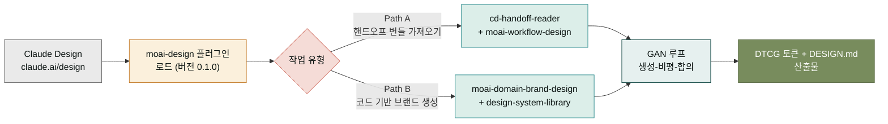

## Claude Design과 한 팀이 되는 플러그인, moai-design

`moai-design`은 [Claude Design](https://claude.ai/design)과 짝을 이루는 **에이전틱 디자인 플러그인**입니다. Claude Design이 화면을 그리는 에이전트라면, 이 플러그인은 그 앞뒤로 필요한 일 — 브리프를 다듬고, 브랜드 컨텍스트를 주입하고, 디자인 토큰을 DTCG 포맷으로 맞추고, 완성물을 개발팀에 넘겨주는 핸드오프 번들을 만드는 일 — 을 맡습니다. 버전 0.1.0, 총 11개 스킬로 구성되어 있습니다.

이 플러그인의 핵심 설계는 **GAN 품질 루프**(Generative Adversarial Net에서 따온 표현)입니다. Claude가 만든 결과물을 비평(critic) 스킬이 검토하고, 그 비평을 다시 생성에 넣는 순환 구조를 통해 한 번에 완성물을 만들기 어려운 디자인 작업을 반복적으로 다듬어갑니다. 이 때문에 스킬이 단순한 "프롬프트 모음"이 아니라, 생성·검토·합의의 역할 분담을 코드로 담고 있습니다. 일러스트를 한 장 뽑는 데는 한 스킬이면 충분하지만, 브랜드 일관성을 유지하면서 10페이지짜리 사이트를 찍어내려면 이 루프가 필요합니다.

## 설치 흐름 한눈에 보기

두 경로가 있습니다. **Path A**는 이미 Claude Design이나 Figma에서 만들어진 결과물을 가져와(handoff bundle) 다듬는 경로입니다. **Path B**는 Claude Design 없이 코드 기반으로 브랜드 시스템을 세팅하고 토큰을 생성하는 경로입니다. 어느 쪽이든 마지막에는 GAN 루프(`moai-workflow-gan-loop`)를 거쳐 품질을 교차 검증하고, 최종적으로 DTCG 포맷의 디자인 토큰과 `DESIGN.md` 문서가 산출됩니다.

## 대표 스킬 Top 5

다섯 스킬은 Claude Design 작업의 시작점과 끝점을 잇는 축입니다. 처음 시도하기 좋은 순서로 정렬했습니다.

| 스킬 | 하는 일 | 자주 같이 쓰는 스킬 |
|---|---|---|
| **cd-brief** | Claude Design용 6요소 브리프(Project·Audience·Pages·Tone·Reference·Constraints) 자동 작성 | `cd-prompt-builder`, `cd-system-prep` |
| **moai-workflow-design** | Path A(핸드오프)와 Path B(코드 생성)를 모두 다루는 통합 워크플로 | `cd-handoff-reader`, `moai-workflow-gan-loop` |
| **moai-domain-brand-design** | 브랜드 컨텍스트·로고·타이포·컬러 시스템 도메인 지식 | `moai-domain-copywriting`, `design-system-library` |
| **design-system-library** | 글로벌 브랜드 디자인 토큰 세트 (Tailwind/shadcn 호환) | `moai-domain-brand-design` |
| **cd-handoff-reader** | Claude Design 핸드오프 번들을 읽어 개발용 데이터로 변환 | `moai-domain-design-handoff` |

처음에는 `cd-brief`로 브리프를 잡고, `moai-workflow-design`으로 전체 흐름을 익히는 것을 권합니다. 브랜드 세팅이 선행되는 작업이라면 그 사이에 `moai-domain-brand-design`과 `design-system-library`로 토큰 기반을 깔아 두면 이후 모든 화면에 일관성이 적용됩니다.

## 전체 스킬 인덱스 (11개)

스킬은 `cd-*`(Claude Design 핸드오프 축)과 `moai-*`(도메인·워크플로 축) 두 그룹으로 나뉩니다.

### cd-* — Claude Design 핸드오프 축 (5)

- **cd-brief** — Claude Design용 6요소 브리프 자동 작성. 자연어 한 줄에서 시작해 누락 요소를 차례로 채움.
- **cd-prompt-builder** — 브리프를 Claude Design에 붙여 넣을 수 있는 복붙용 프롬프트로 변환. AI 슬롭 회피 블록 포함.
- **cd-system-prep** — Claude Design 세션 시작 전 시스템 준비. 모델·온도·컨텍스트 세팅.
- **cd-slop-check** — AI 슬롭(AI 특유의 상투적 표현) 검출. GAN 루프의 critic 역할.
- **cd-handoff-reader** — Claude Design이 내보낸 핸드오프 번들을 파싱해 개발용 데이터로 변환.

### moai-* — 도메인·워크플로 축 (6)

- **moai-workflow-design** — 통합 디자인 워크플로 (Path A + Path B). DTCG 토큰 검증, 브랜드 우선순위 강제.
- **moai-workflow-gan-loop** — 생성·비평·합의 GAN 품질 루프. 반복 횟수와 종료 조건 설정.
- **moai-domain-brand-design** — 브랜드 아이덴티티 도메인 지식 (로고·타이포·컬러·레이아웃).
- **moai-domain-copywriting** — 브랜드 톤 일관된 카피라이팅 도메인.
- **moai-domain-design-handoff** — 디자인 산출물을 개발팀에 넘기는 핸드오프 명세.
- **design-system-library** — 글로벌 브랜드 디자인 토큰 라이브러리. DTCG 포맷, Tailwind/shadcn 호환.

## 레시피 — 스킬을 엮어서 쓰는 흐름

### 레시피 1 — Claude Design 핸드오프 풀사이클 (Path A)

`cd-brief` (브리프 작성) → `cd-system-prep` (세션 준비) → `cd-prompt-builder` (Claude Design용 프롬프트) → (Claude Design에서 생성) → `cd-handoff-reader` (핸드오프 번들 읽기) → `cd-slop-check` (AI 슬롭 검토) → `moai-domain-design-handoff` (개발용 명세).

### 레시피 2 — 코드 기반 브랜드 시스템 구축 (Path B)

`moai-domain-brand-design` (브랜드 지식 주입) → `design-system-library` (토큰 세트 선택) → `moai-workflow-design` (토큰 → 컴포넌트 생성) → `moai-workflow-gan-loop` (3회 순환 품질 검증) → `DESIGN.md` 문서 산출.

### 레시피 3 — 카피·디자인 일관성 확보

`moai-domain-copywriting` (브랜드 톤 카피) ↔ `moai-domain-brand-design` (시각 일관성). 두 스킬을 번갈아 호출하며 카피와 비주얼이 같은 톤을 유지하도록 맞춤.

## 다음 단계

- **[Claude Design 핸드오프 공식 규격](https://claude.ai/design)** — 핸드오프 번들의 원본 포맷.
- **[moai-cowork 플러그인](/plugins/cowork/)** — 디자인 산출물을 실무 문서(PPT, PDF)로 마무리할 때.
- **[moai-code 플러그인](/plugins/code/)** — 핸드오프된 토큰을 코드로 반영할 때.

---

### Sources

- moai-design 플러그인 소스: [`/plugins/moai-design/`](https://github.com/modu-ai/claude.mo.ai.kr/tree/main/plugins/moai-design) (스킬 11개 디렉터리 포함)
- 마켓플레이스 진실 원본: [`/plugins/moai-design/.claude-plugin/plugin.json`](https://github.com/modu-ai/claude.mo.ai.kr/blob/main/plugins/moai-design/.claude-plugin/plugin.json) (`name: design`, `displayName: MoAI Design`, `version: 0.1.0`)
- Claude Design: <https://claude.ai/design>
- DTCG (Design Tokens Community Group) 포맷: <https://www.designtokens.org/>
- Claude Design 핸드오프 공식 규격 (03 §5.4): 프로젝트 내 `docs/plugin-family-design/` 참조
