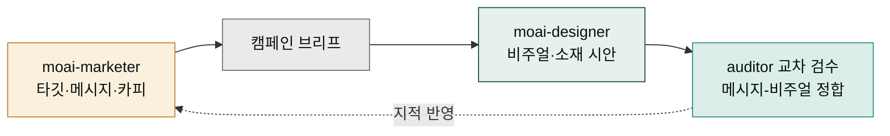
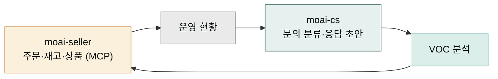
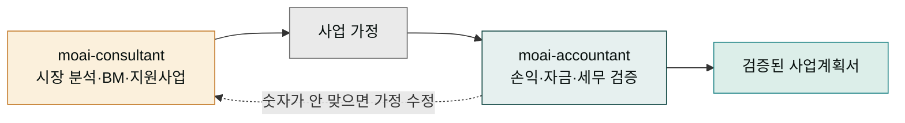

플러그인은 한 명씩 채용해도 충분히 일하지만, 진짜 힘은 **조합**에서 나옵니다. 실제 회사 업무가 한 직무 안에서 끝나는 일이 드물듯 — 캠페인에는 기획과 디자인이, 쇼핑몰 운영에는 판매와 고객 응대가 같이 필요합니다 — 플러그인 직원들도 짝을 지어 부릴 때 산출물의 완성도가 달라집니다.

다행히 조합에 특별한 설정은 필요 없습니다. 필요한 직원들을 설치해 두기만 하면, 한 세션 안에서 자연어로 두 직무를 오가며 시키거나, 단계별로 담당 직원을 지목해 릴레이시킬 수 있습니다. 이 페이지는 처음 조합을 시도하는 분을 위해 검증된 패턴 세 가지와, 프로젝트 단위로 팀을 셋업하는 PM 허브 사용법을 소개합니다.

## 시작은 단일 직원부터

처음이라면 직원 한 명으로 시작하세요. 예를 들어 `moai-marketer`만 설치하고 "다음 달 뉴스레터 3회분 기획해줘"부터 시켜 보는 겁니다. 단일 직원 운용에 익숙해지면 — 스킬이 자동으로 붙는 감각, worker에게 시키고 auditor로 검수하는 리듬([전문가 에이전트 이해](../agents/) 참고) — 그때 두 번째 직원을 채용하면 됩니다. 한 번에 18명을 다 설치하면 오히려 누구에게 뭘 시킬지 헷갈립니다.

## 조합 사례 1 — 마케터 × 디자이너: 캠페인 제작

신제품 런칭 캠페인을 준비한다고 해 봅시다. `moai-marketer`가 타깃 분석과 메시지 전략, 채널별 카피를 만들고, 그 결과물을 브리프 삼아 `moai-designer`가 비주얼 방향과 브랜드 토큰에 맞는 소재 시안을 잡습니다. 마지막으로 마케터의 auditor에게 "카피와 비주얼이 같은 메시지를 말하고 있는지" 교차 검수를 시키면 한 바퀴가 끝납니다. 전략 따로 디자인 따로 만들 때 흔한 "말과 그림이 따로 노는" 문제를, 브리프를 사이에 끼운 릴레이로 예방하는 패턴입니다.



## 조합 사례 2 — 셀러 × CS 매니저: 쇼핑몰 운영

스마트스토어를 운영 중이라면 `moai-seller`와 `moai-cs`가 자연스러운 짝입니다. 셀러가 주문·재고·상품 문의를 MCP 연동으로 조회·처리하는 동안, CS 매니저는 쌓인 고객 문의를 유형별로 분류하고 응답 초안을 만들며 반복 문의를 지식베이스로 정리합니다. 주기적으로 CS 매니저의 VOC(고객의 소리) 분석을 셀러에게 넘겨 "환불 문의가 몰리는 상품의 상세페이지 보완"처럼 판매 쪽 개선으로 되먹임하면, 응대와 판매가 한 몸으로 돌기 시작합니다.



## 조합 사례 3 — 컨설턴트 × 회계사: 창업 아이템 검증

창업을 준비하는 분이라면 `moai-consultant`와 `moai-accountant` 조합으로 아이템을 이중 검증할 수 있습니다. 컨설턴트가 시장 규모(TAM/SAM/SOM) 분석과 비즈니스 모델, 정부 지원사업 매칭까지 사업의 "바깥쪽" 타당성을 세우면, 회계사가 그 가정을 받아 손익 구조와 초기 자금 계획, 세무 관점의 "안쪽" 숫자를 검증합니다. 컨설턴트의 장밋빛 시나리오를 회계사의 숫자가 견제하는 구도 자체가 검증 장치입니다.



## 어떤 조합이든 — worker → auditor 품질 루프

세 사례 모두에 공통으로 깔린 원리가 있습니다. **만드는 에이전트와 검수하는 에이전트를 분리해 한 바퀴 이상 돌린다**는 것입니다. 조합 시나리오에서는 특히 서로 다른 직원의 auditor에게 교차 검수를 시키는 것이 효과적입니다 — 마케터의 산출물을 디자이너 관점에서, 컨설턴트의 계획을 회계사 관점에서 보게 하면, 같은 직무 안에서는 보이지 않던 구멍이 드러납니다. 자세한 호출 문형은 [전문가 에이전트 이해](../agents/)를 참고하세요.

## PM 허브로 프로젝트 단위 셋업

직원 조합이 프로젝트 단위로 반복된다면, 매번 손으로 지시를 짜는 대신 `moai-pm` 플러그인의 `/project` 명령으로 셋업을 자동화할 수 있습니다. PM은 프로젝트 폴더에 어떤 직원들을 배치할지, 각 직원에게 어떤 프로젝트 맥락(브랜드, 제품, 톤)을 공유할지를 초기화해 주는 **프로젝트 허브** 직원입니다.

```bash
claude plugin install moai-pm@moai-claude
```

설치 후 프로젝트 폴더에서 Claude Code를 열고 `/project`를 실행하면, 프로젝트 성격을 묻는 인터뷰를 거쳐 직원 배치와 공통 지침 파일이 만들어집니다. 이후 그 폴더에서 여는 모든 세션이 같은 프로젝트 맥락을 공유하므로, 위의 조합 패턴들을 "매번 설명 없이" 반복할 수 있게 됩니다.

## 다음 단계

- 각 직원의 스킬과 에이전트 카드 → [에이전트 팀 소개](/moai-agents/)
- 설치·업데이트 명령이 헷갈릴 때 → [설치와 관리](../install/)
- 에이전트 호출 문형 복습 → [전문가 에이전트 이해](../agents/)

---

### Sources

- 마켓플레이스 진실 원본: [`/.claude-plugin/marketplace.json`](https://github.com/modu-ai/claude/blob/main/.claude-plugin/marketplace.json)
- Claude Code 서브에이전트 공식 문서: <https://code.claude.com/docs/en/sub-agents>
