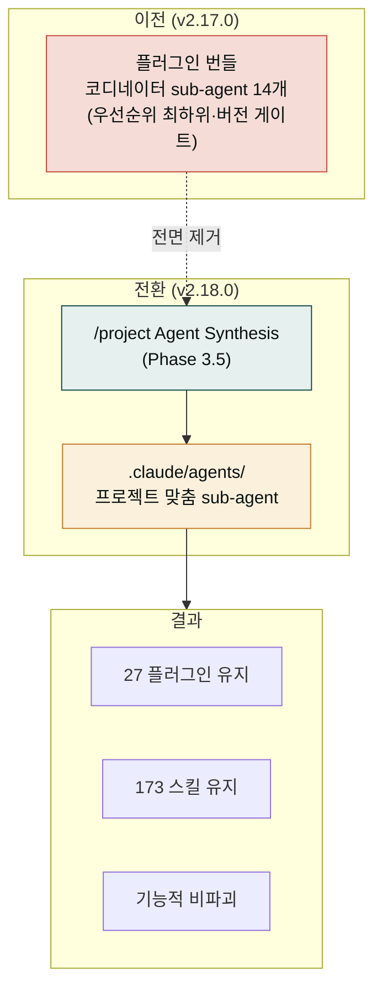

**릴리스 날짜**: 2026-06-15
**버전**: v2.18.0 (MINOR)
**업데이트 명령**: `/plugin marketplace update cowork-plugins`



## Highlights

v2.18.0은 **Cowork 에이전트 모델 전환** 릴리스입니다. v2.17.0이 도입했던 **플러그인 번들 코디네이터 sub-agent 14개**(문서상 11종으로 소개되던 그 묶음)를 전면 제거하고 대신 `/project`가 **사용자 프로젝트에 맞춤 sub-agent를 직접 생성**하는 Agent Synthesis 모델로 일원화했습니다.

플러그인에 sub-agent를 번들로 끼워 넣는 방식은 우선순위가 가장 낮고, 사용자가 설치한 플러그인 버전에 묶이며, orchestrator 역할과 중복됐습니다. 이를 프로젝트 단위 생성으로 옮기면 에이전트가 **그 프로젝트의 실제 워크플로우에 맞게** 만들어지고, 플러그인 번들보다 우선순위가 높으며, Cowork가 자동으로 로드합니다.

- **플러그인 번들 코디네이터 14개 전면 제거** — 기능 손실은 없습니다. 기존 스킬 체인은 자연어 인라인 호출로 동일한 결과를 냅니다.
- **`/project` Agent Synthesis (Phase 3.5)** — 자격 조건을 갖춘 워크플로우에 한해 사용자 `.claude/agents/`에 맞춤 sub-agent를 생성합니다.
- **moai-core:project 스킬 현대화** — 22→27 플러그인 / 143→173 스킬 정합, Phase 2 화이트리스트 동적 도출, 폐기된 harness 모델·글로벌 프로필 잔재 제거, 커맨드 표면 bare `/project` 기본 동작.

카운트 **27 플러그인 / 173 스킬 유지**(변동 없음). Breaking change 없음 — 기존 워크플로우는 그대로 동작합니다.


**기존 워크플로우 그대로 동작합니다**: 이번 릴리스는 카운트가 바뀌지 않는 구조 전환입니다. 제거된 코디네이터 sub-agent가 하던 일은 스킬 체인의 자연어 인라인 호출로 동일하게 처리되며, 새로 생성되는 프로젝트 에이전트는 **새 세션**에서 활성화됩니다.


## What's New

### `/project` Agent Synthesis — Phase 3.5

`/project` 워크플로우에 **Phase 3.5(Agent Synthesis)** 단계가 추가되었습니다. `/project`가 프로젝트의 산출물·체인을 분석한 뒤, 전담 에이전트로 만들 가치가 있는 워크플로우를 골라 사용자 프로젝트의 `.claude/agents/` 폴더에 맞춤 sub-agent를 생성합니다.

**자격 규칙(eligibility)** — 아무 워크플로우나 에이전트로 만들지 않습니다. 다음 세 가지 중 하나에 해당하는 경우에만 생성합니다.

| 자격 조건 | 설명 |
|---|---|
| **고정 다단계 + 비우회 게이트** | 단계 순서가 고정되어 있고, 중간에 반드시 거쳐야 하는 검수·승인 게이트가 있는 워크플로우 |
| **병렬 fan-out** | 여러 하위 작업으로 갈라져 동시에 처리해야 효율이 나는 워크플로우 |
| **빈번한 반복** | 매주·매월처럼 같은 절차를 자주 반복하는 워크플로우 |

위 조건에 맞지 않는 단순·일회성 작업은 에이전트를 만들지 않고 스킬 체인의 자연어 인라인 호출로 처리합니다.

**우선순위와 활성화**:

- 프로젝트 에이전트(`.claude/agents/`)는 **플러그인 번들 에이전트보다 우선순위가 높습니다**.
- Cowork가 프로젝트 에이전트를 **자동으로 로드**합니다.
- 새로 생성된 에이전트는 **새 세션에서 활성화**됩니다(현재 세션에는 즉시 반영되지 않음).


**왜 프로젝트 단위인가**: 플러그인에 번들된 에이전트는 모든 사용자에게 동일하게 고정되지만, `/project`가 생성하는 에이전트는 그 프로젝트의 실제 산출물·체인·반복 주기를 보고 만들어집니다. 같은 "재무 리포트"라도 회사마다 단계와 게이트가 다르므로, 프로젝트 단위 생성이 더 정확합니다.


## Changed

- **moai-core:project 스킬 현대화**
  - 플러그인·스킬 카운트 정합: 22→**27 플러그인** / 143→**173 스킬** 기준으로 갱신
  - **Phase 2 화이트리스트 동적 도출** — 이전에는 화이트리스트가 정적이라 신규 5개 플러그인이 누락되는 버그가 있었습니다. 이제 설치된 `moai-*` 플러그인을 동적으로 도출해 누락을 해소했습니다.
  - 폐기된 harness 모델·글로벌 프로필(`moai-profile.md`) 잔재 제거
- **커맨드 표면 정리** — bare **`/project`가 기본 동작**이 되었습니다. `/project init`은 레거시 별칭으로 계속 동작합니다.
- 파이프라인 로직 보존 — 제거된 코디네이터가 묶던 스킬 체인은 Phase 3.5 예시로 보존되어, 자연어 인라인 호출 형태로 동일한 결과를 냅니다.

## Removed

- **플러그인 번들 코디네이터 sub-agent 14개 전면 제거** (v2.17.0에서 11종으로 소개되던 묶음)
  - 제거 사유: 플러그인 번들 에이전트는 (1) 우선순위가 가장 낮고, (2) 사용자가 설치한 플러그인 버전에 게이트되며, (3) orchestrator 역할과 중복됩니다.
  - 파이프라인 로직은 손실되지 않습니다 — `/project` Agent Synthesis(Phase 3.5) 예시로 보존되어, 필요 시 프로젝트 맞춤 에이전트로 재현됩니다.

## Fixed

- **book·commerce 코디네이터 YAML 파싱** — 제거 대상 코디네이터의 frontmatter YAML 파싱 오류 정정(제거 과정에서 함께 정리).
- **moai-office 5개 SKILL.md의 삭제된 `doc-qa` 참조 정정** — 이미 삭제된 `doc-qa` 에이전트를 참조하던 5개 SKILL.md를 **인라인 자체검수**로 교체.

## Migration

- **사용자 조치 불필요** — 기존 워크플로우는 그대로 동작합니다. 코디네이터 sub-agent를 직접 호출하던 적이 있더라도, 동일한 작업을 자연어로 요청하면 스킬 체인이 동일하게 실행됩니다.
- **프로젝트 에이전트를 쓰려면** — `/project`(또는 레거시 `/project init`)를 실행하면 자격 조건에 맞는 워크플로우에 한해 `.claude/agents/`에 맞춤 에이전트가 생성됩니다. 생성된 에이전트는 **새 세션**에서 활성화됩니다.
- **카운트 변동 없음** — 27 플러그인 / 173 스킬 그대로입니다. 플러그인을 추가로 설치하거나 제거할 필요가 없습니다.

## 업그레이드 방법

1. **마켓플레이스 캐시 갱신**:

   ```text
   /plugin marketplace update cowork-plugins
   ```

2. **플러그인 상세 재진입** — 업데이트 후 플러그인 상세 페이지를 다시 열어 새 버전(v2.18.0)이 반영됐는지 확인하세요.

3. **(선택) 프로젝트 에이전트 생성** — 고정 다단계·병렬 fan-out·빈번 반복 워크플로우가 있다면 `/project`를 실행해 맞춤 에이전트를 생성합니다. 새 세션에서 활성화됩니다.

4. **API 키 재등록 불필요** — 이번 릴리스는 커넥터·키 정책을 바꾸지 않습니다.

기존 워크플로우(v2.17.0까지)는 그대로 동작합니다.

## 사용 예시

```text
> 회사 재무 리포트를 매달 만드는데 전담 에이전트로 만들어줘
→ /project Agent Synthesis → "빈번 반복" 자격 판정 → .claude/agents/finance-report-agent 생성
→ 새 세션에서 활성화 → 매월 동일 절차를 전담 에이전트가 실행
```

```text
> 상품 출시 준비 처음부터 끝까지 한 번에 도와줘
→ (코디네이터 없이) 자연어 인라인 호출로 시장조사 → 상품명 → 채널 메시지 → 통합 전략 스킬 체인 동일 실행
```

## 관련 문서 & 출처

- **CHANGELOG**: [전체 변경 사항](https://github.com/modu-ai/cowork-plugins/blob/main/CHANGELOG.md)
- **moai-core 플러그인 페이지**: [/plugins/moai-core/](../../plugins/moai-core/)
- **이전 릴리스 노트**: [v2.17.0](../v2.17/) · [v2.16.0](../v2.16/) · [v2.15.0](../v2.15/)
